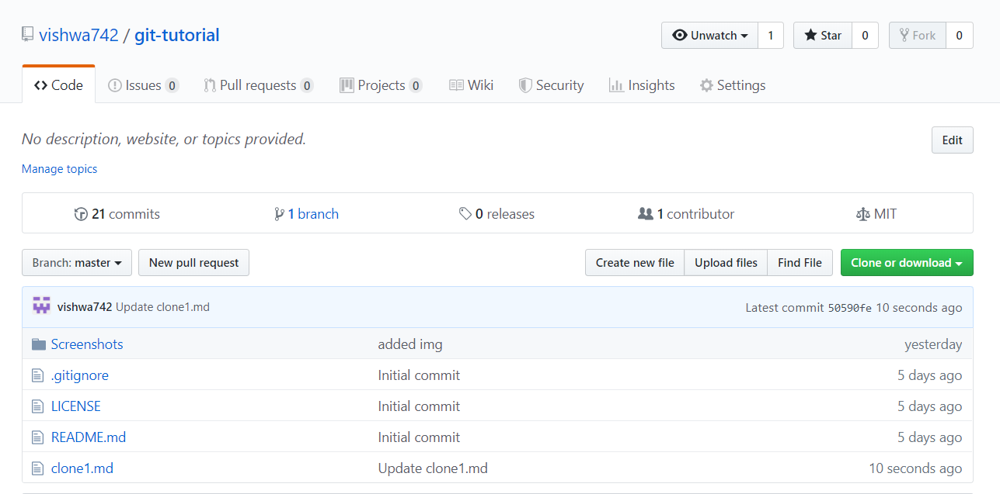

# Learning Git
## Clone
Cloning a repository means that we create a local copy of the cody provided by the developer.
### Syntax 
```
git clone "url of the repository"

```


## Steps to follow while cloning a Repository
-  On github navigate to the main page of the 



-  Under the repository name click on clone or download
 
- There are two options to clone:

  -  **Using HTTPS**: To clone the repository using HTTPS, under "Clone with HTTPS" 
  
  - **Using SSH**: To clone the repository using an SSH key, including a certificate issued by your organization's SSH certificate authority, click Use SSH.
 
-  Open 

-  Change the current working directory to the location where you want to the cloned directory to be made.

-  Type git clone and paste the URL that you copied

```
 git clone https://github.com/vishwa742/git-tutorial.git

```

-  Press enter and the repository will be cloned.
   
   
