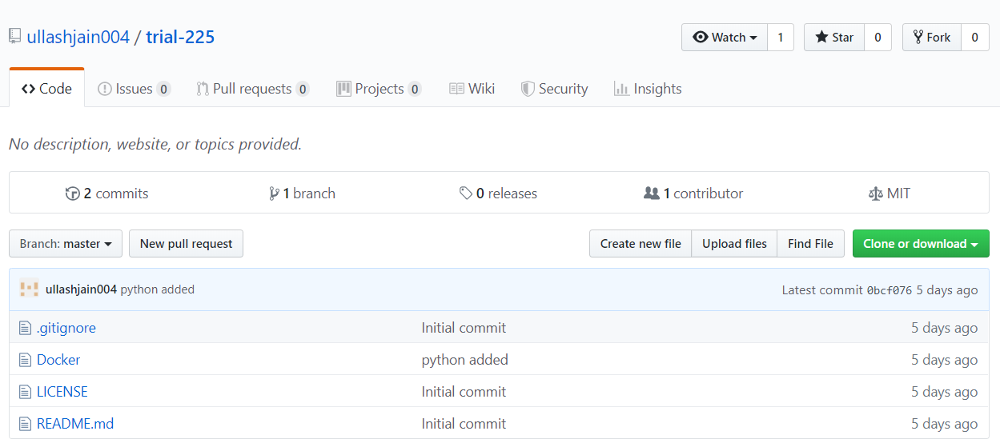
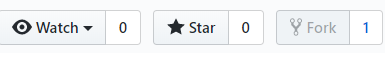
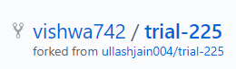

# Learning Git
## Fork
A fork is a copy of the repository. Forking a repository allows the user to makes changes to the project without affecting the original repository.

Forking allows you to make changes on someone else's repository and propose these changes to them.

## Steps to follow while Forking a Repository
-  On github navigate to the main page of the repository you want to clone

-  Click on the fork button to create a copy of the repository

-  The number beside the fork button shows how many times the repository has been forked. Once you fork the repository, you can see that number increase by 1.

-  After you forked the repository, a copy of the original repository will be available in the list of your repositories.

-  As we can see from the image we have forked the repository `trial-225`.Originally created by the user `ullashjain004`, we have created a copy of that repository.

-  Any changes made to the forked repository, `vishwa742/trial-225`, won't reflect on the original repository, `ullashjain004/trial-225`.  
