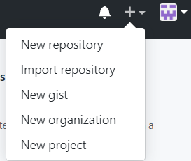
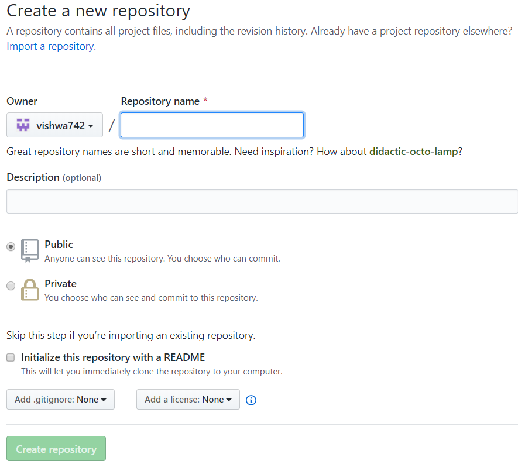

# Learning Git
## Repository

### What is a repository?

A repository is like a folder for your project. Your project's repository contains all of your project's files and stores each file's revision history. You can also discuss and manage your project's work within the repository.

### Creating a repository

-  In order to create a repository click on the ` + ` button on the top right corner of the screen and select new repository.

-  Type a name for your repository, and an optional description. Choose to make the repository either public or private. Public repositories are visible to the public, while private repositories are only accessible to you.

  -  You can create a [README file](https://help.github.com/en/articles/about-readmes), which is a document describing your project. 

  -  You can create a [.gitignore file](https://help.github.com/en/articles/ignoring-files), which is a set of ignore rules. 

  -  You can choose to add a software [license](https://help.github.com/en/articles/licensing-a-repository) for your project. 
  
  
  
-  Once you click on create your repository will be created.